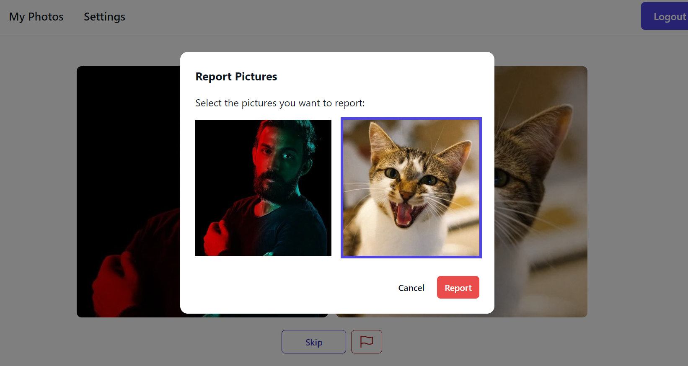
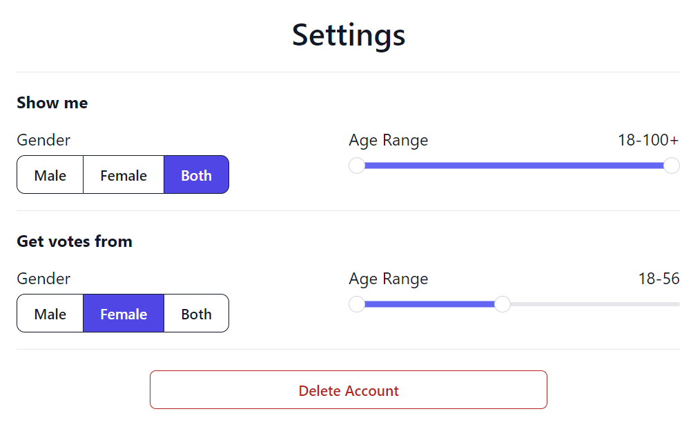

# Photo Ranker

Photo Ranker is a web application designed to offer both an engaging and unbiased way to rank photos. Through a unique side-by-side binary voting system, users can obtain an honest and accurate rating for their photos. This approach not only makes voting more fun but also ensures clarity and determinism, removing the gray areas often found in traditional 1-10 rating systems.

### [Live Link](https://photoscorer.com)

  

## Motivations

The goal of Photo Ranker is to address a common problem: receiving honest feedback on photos. Friends and acquaintances might be too kind, while numerical ratings can lead to indecision and biases. Photo Ranker's binary choice system, inspired by the Glicko-2 algorithm used in chess, aims to:

- **Make Voting Fun:** The side-by-side approach makes voting an engaging experience.
- **Reduce Biases:** The binary choice is clear and deterministic.
- **Help Users Select Their Best Picture:** Especially useful when undecided between photos.
- **Allow Customizable Experience:** Filter who sees and votes on your photos.

## Features

- **Voting System:** Users choose their favorite between two random photos.
- **Photo Publishing & Rating:** Pictures are rated 0-10 based on community voting.
- **Sorting Options:** Users can sort their pictures by score, number of votes, or creation date.
- **Customizable Settings:** Settings allow filtering votes by gender and age.

## Visual Demonstrations

- **Report Feature:**

  

- **Picture Uploading:**

  

- **Score Sorting:**

  

- **Settings Page:**

  

